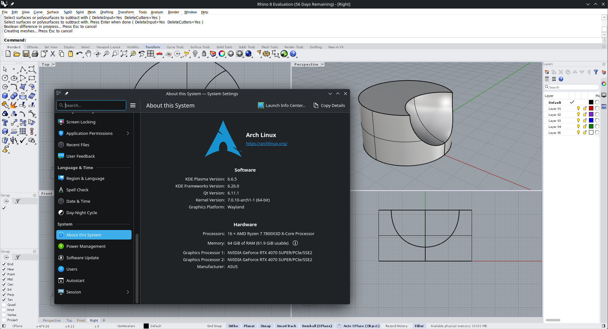

# rhino8-wine

Patches and instructions to run **Rhinoceros 8** on Linux under Wine 11.9.

Tested on **Ubuntu 24.04.4 LTS (Noble Numbat)**, kernel 6.17, with Rhino **8.31.26126.13431**.

_Note: Claude Code was used in this project._

Rhino 8 uses .NET 8 via Microsoft's CLR, which was not working when trying to run with Wine. Initially, installation was successful however a stack overflow would occur when trying to run Rhino 8: 

`err:virtual:virtual_setup_exception stack overflow 4672 bytes addr 0x6ffffff85ebe stack 0x7ffffe0ffdc0 (0x7ffffe100000-0x7ffffe101000-0x7ffffe200000)`

Patches:

1. **WoW64 32-bit thread stacks too small for .NET 8 CLR bootstrap** — Wine's 1MB default is insufficient for .NET's initialization call depth on Wine. Patched `ntdll` to enforce an 8MB minimum on WoW64 stacks.
2. **.NET calibrates recursion depth from `VirtualQuery`** — if Wine reports a stack larger than 1MB, .NET calibrates aggressively and overflows. Patched `ntdll` to clamp the reported stack size to 1MB.
3. **Dark mode detection caused 254,955-deep mutual recursion** — `rhcommon_c.dll`'s `RHC_RhOSInDarkMode` and the managed `get_DarkMode()` called each other indefinitely on Wine. Fixed with a binary patch to make it always return light mode.

Environment Specific Issues:

1. **Wine can't verify Microsoft Authenticode signatures** — missing CA root store causes installer verification to fail. Patched `wintrust` to return success while still populating certificate state.
2. **OAuth licensing callback (port 1717) never bound** — stale `http.sys` state from a previous run blocked the port. Fixed by killing the wineserver before launch.

See [WINE_PORTING_NOTES.md](WINE_PORTING_NOTES.md) for a detailed writeup of each problem.

---

## Setup

### Ubuntu 24.04 LTS

#### 1. Install build dependencies

```bash
sudo apt update
sudo apt install -y \
  build-essential git autoconf bison flex python3 pkg-config \
  gcc-mingw-w64 \
  libx11-dev libxext-dev libxrandr-dev libxcomposite-dev libxcursor-dev \
  libxi-dev libxinerama-dev libxrender-dev libxxf86vm-dev \
  libxfixes-dev libxdamage-dev \
  libfreetype-dev libfontconfig-dev \
  libgnutls28-dev \
  libgl-dev \
  libvulkan-dev vulkan-headers \
  libwayland-dev \
  libpulse-dev \
  libcups2-dev libpcap-dev libsdl2-dev libv4l-dev \
  ocl-icd-opencl-dev libpcsclite-dev unixodbc-dev \
  libgstreamer1.0-dev libgstreamer-plugins-base1.0-dev \
  libssl-dev
```

#### 2. Build and install the patched Wine

Ubuntu doesn't have `makepkg` so build manually:

```bash
git clone https://github.com/ItHasLegs/rhino8-wine
cd rhino8-wine

# Clone Wine at the tested commit
git clone https://github.com/wine-mirror/wine.git wine-src
cd wine-src
git checkout 11c0254541e169e80495f4f48f7231af36ff8a0c
cd ..

# Apply the patch
cd wine-src
git apply ../rhino8-wine.patch
cd ..

# Configure and build
mkdir wine-build && cd wine-build
../wine-src/configure \
  --prefix=/opt/wine-rhino8 \
  --enable-archs=i386,x86_64 \
  --with-x \
  --with-wayland \
  --with-vulkan \
  --with-openssl
make -j$(nproc)
sudo make install
```

---

### Arch Linux

#### 1. Install build dependencies

```bash
sudo pacman -S --needed \
  base-devel git \
  mingw-w64-gcc \
  autoconf bison flex perl python \
  lib32-glibc lib32-gcc-libs \
  vulkan-headers \
  fontconfig freetype2 gnutls libxcomposite libxcursor libxdamage \
  libxext libxfixes libxi libxinerama libxrandr libxrender libxxf86vm \
  mesa opencl-icd-loader openssl pcsclite sdl2 v4l-utils \
  vulkan-icd-loader wayland gst-plugins-base-libs libcups libpcap libpulse
```

#### 2. Build and install the patched Wine

```bash
git clone https://github.com/ItHasLegs/rhino8-wine
cd rhino8-wine
makepkg -si
```

Clones Wine at the tested commit, applies the patches, builds (~20–40 min), and installs to `/opt/wine-rhino8`. Your system Wine is untouched.

---

### 3. Install Rhino

```bash
export WINEPREFIX=~/.local/share/wineprefixes/rhino8
export WINE=/opt/wine-rhino8/bin/wine

# Create the prefix
WINEPREFIX=$WINEPREFIX WINEDEBUG=-all $WINE wineboot

# Run the Rhino installer — it bundles and auto-installs all prerequisites
# (VC2013, VC2015, WebView2, .NET 8 Desktop Runtime, ASP.NET Core Runtime)
WINEPREFIX=$WINEPREFIX WINEDEBUG=-all $WINE RhinoInstaller.exe
```

The `wintrust` patch (included in `rhino8-wine.patch`) is required for the installer to complete — Wine lacks the Microsoft CA root store needed to verify the installer's Authenticode signatures, and without the patch it fails during package verification.

### 4. Apply the rhcommon_c.dll binary patch

Rhino ships `rhcommon_c.dll` — this file is present after running the Rhino 8 installer. Patch the local copy:

```bash
DLL="$HOME/.local/share/wineprefixes/rhino8/drive_c/Program Files/Rhino 8/System/rhcommon_c.dll"
cp "$DLL" "$DLL.bak"
printf '\x31\xc0\xc3\x90\x90\x90\x90' | \
    dd of="$DLL" bs=1 seek=$((16#dff50)) conv=notrunc
```

This replaces the `RHC_RhOSInDarkMode` JMP thunk with `xor eax,eax; ret` (always returns light mode), preventing the mutual recursion crash.

If you're on a different Rhino 8 build and this offset doesn't match (or the
crash persists), use [`find-darkmode-patch.sh`](find-darkmode-patch.sh) to
relocate the export and patch it automatically — see the
[Rhino 9 WIP](#rhino-9-wip-experimental) section below for usage.

### 5. Run Rhino

```bash
./run-rhino.sh
```

If the licensing OAuth flow fails (Firefox redirects to `http://127.0.0.1:1717/` and gets "can't connect"), run:

```bash
./run-rhino.sh --fresh
```

This kills and restarts the wineserver, resetting the internal HTTP server state that handles the OAuth callback.

### Ubuntu 24.04


### Arch Linux



---

## Rhino 9 WIP (Experimental)

The same `wine-rhino8` build also runs the Rhino 9 WIP installer and Rhino 9
itself — no source patches needed updating. Two extra steps are required
beyond the Rhino 8 instructions above. Rhino 9 WIP changes frequently; see
[WINE_PORTING_NOTES.md](WINE_PORTING_NOTES.md#rhino-9-wip-experimental) for
the details and version-specific numbers behind these steps.

Use a separate prefix so your working Rhino 8 setup is unaffected:

```bash
export WINEPREFIX=~/.local/share/wineprefixes/rhino9wip
export WINE=/opt/wine-rhino8/bin/wine

WINEPREFIX=$WINEPREFIX WINEDEBUG=-all $WINE wineboot

# Run the Rhino 9 WIP installer (GUI, needs a real X11/Wayland session —
# even with /quiet, Burn's bootstrapper requires a window and will hang
# without one)
WINEPREFIX=$WINEPREFIX WINEDEBUG=-all $WINE /path/to/rhino_9.x.x.x.exe
```

### 1. Patch `rhcommon_c.dll` (dark-mode recursion)

Same underlying bug as Rhino 8's dark-mode patch, but at a different offset
in this DLL build. Use the helper script instead of a hardcoded offset:

```bash
./find-darkmode-patch.sh "$WINEPREFIX/drive_c/Program Files/Rhino 9 WIP/System/rhcommon_c.dll" --apply
```

### 2. If viewports render incorrectly, try switching GPU Technology to OpenGL

Rhino 9 WIP defaults to Direct3D for viewport rendering. On at least one
tested system (Nvidia, Wayland/XWayland), this rendered incorrectly under
Wine (red/black viewports, objects vanishing after the command that created
them finishes); switching to OpenGL fixed it. This is likely
platform-dependent (GPU vendor/driver/Vulkan setup), so your mileage may
vary. If you hit similar symptoms: **Options → View → GPU → GPU Technology →
OpenGL**, then restart Rhino.

### 3. Run Rhino 9

```bash
DISPLAY="${DISPLAY:-:0}" WINEPREFIX=$WINEPREFIX $WINE \
  "$WINEPREFIX/drive_c/Program Files/Rhino 9 WIP/System/Rhino.exe"
```
